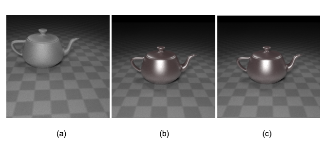
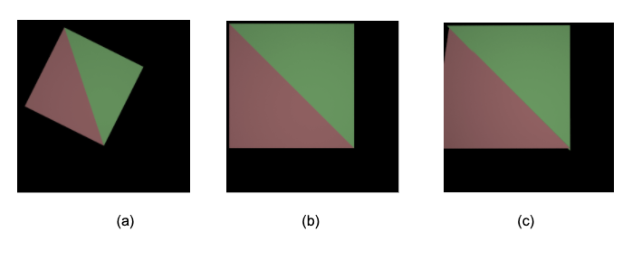

Inverse rendering seeks to find the scene parameters given observed images. With the scene parameters, changes in the output 2D image can be back-propagated to get parameters to render a 3D scene. Besides general better human analyst understanding, this technique can be used for several applications:
1.  Discovering adversarial examples of 3D scenes that fool a neural network. It can do this by allowing generation of samples with different settings like camera pose, light intensity, light source position, global translation, rotation, and vertex displacement [0].
2. Estimating human body shape from depth sensors and RGB data [1].
3. 2D to 3D style transfer [2].
4. 3D deep dream [2].

# Table Of Contents

1. [How To Run](#how-to-run)
2. [Background](#Background)
3. [References](#References)

# How To Run
1. Build the Dockerfile with `docker build -t inverse-renderer .`
2. Run the container with `docker run -it inverse-renderer`
3. Find the results of rotated to upright square example explained in the next section in `cd redner/tests/results`

# Background

The Redner paper [0] introduces a general-purpose differentiable ray tracer, which is the first comprehensive solution to compute derivatives of scalar functions over a rendered image with respect to arbitrary scene parameters. Computing the gradient of rendering is challenging because the rendering integral includes visibility terms that are not differentiable. Previous work in differentiable rendering has focused on fast, approximate solutions using simpler rendering models that only handle primary visibility, and ignore secondary effects such as shadows and indirect light [2][3]. In this work, the authors propose an algorithm to compute derivatives of scalar functions over a physically-based rendered image with respect to arbitrary input parameters (camera, light materials, geometry, etc.). They integrate the differentiable ray tracer with the automatic differentiation library PyTorch [4] for efficient integration with optimization and learning approaches. The scene geometry, lighting, camera and materials are parameterized by PyTorch tensors, which enables a complex combination of 3D graphics, light transport, and neural networks. Backpropagation runs seamlessly across PyTorch and the renderer. Redner’s source code has been released and is available on GitHub [5] 
Redner can optimize camera position, diffuse/specular reflectance, roughness of the teapot as shown in Fig. 1

Fig. 1: (a) Initial rendered scene (b) Target image (c) Rendered from learned scene parameters from target image

Redner offers rendering APIs to draw 3D shapes, choosing the material of the shapes, and adding EXR [6] images into a scene. In addition, camera parameters can also be specified. Shapes can be constructed by specifying the vertices of a triangle. Polygons and therefore any sort of shape can be rendered by specifying shapes in vertices of a triangle.
After rendering a scene, a view (an image) from the scene can be modified and then the gradients can be calculated back to the parameters of the scene. In other words, we can find the parameters that were used to render a modified image.
As a first test to confirm our understanding of the system, we made the necessary modifications to be able to render a scene with a rotated square (Fig. 2a) and then changed it to an upright square (Fig. 2b) and calculated the gradients. Using the resulting parameters from the gradients, we rendered the scene again with the parameters of an upright square (Fig. 2c).

Fig.2: (a) Rendering a scene (source) (b) Changing the scene (target) (c) Calculating the gradients and rendering the modified scene again with learned parameters.

# References
[0] Li, Tzu-Mao and Aittala, Miika and Durand, Fredo and Lehtinen, Jaakko. Differentiable Monte Carlo Ray Tracing through Edge Sampling. ACM Trans. Graph. (Proc. SIGGRAPH Asia) 2018, Vol. 37. 222:1-222:11.

[1] Matthew M. Loper and Michael J. Black. 2014. OpenDR: An Approximate Differentiable Renderer. In European Conference on Computer Vision, Vol. 8695. 154–169.

[2] Hiroharu Kato, Yoshitaka Ushiku, and Tatsuya Harada. 2018. Neural 3D Mesh Renderer. In Conference on Computer Vision and Pattern Recognition. 3907–3916.

[3] Matthew M. Loper and Michael J. Black. 2014. OpenDR: An Approximate Differentiable Renderer. In European Conference on Computer Vision, Vol. 8695. 154–169.

[4] Adam Paszke, Sam Gross, Soumith Chintala, Gregory Chanan, Edward Yang, Zachary DeVito, Zeming Lin, Alban Desmaison, Luca Antiga, and Adam Lerer. 2017. Automatic differentiation in PyTorch. (2017).

[5] Redner source code: https://github.com/BachiLi/redner

[6] Kainz, F and Bogart, R and Hess, D. OpenEXR image file format. 2004
